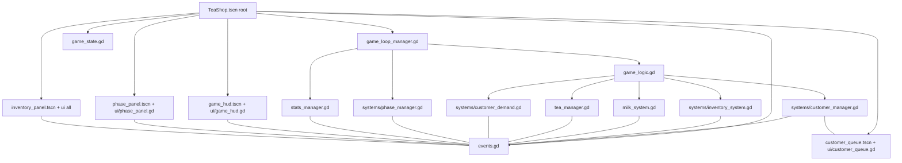
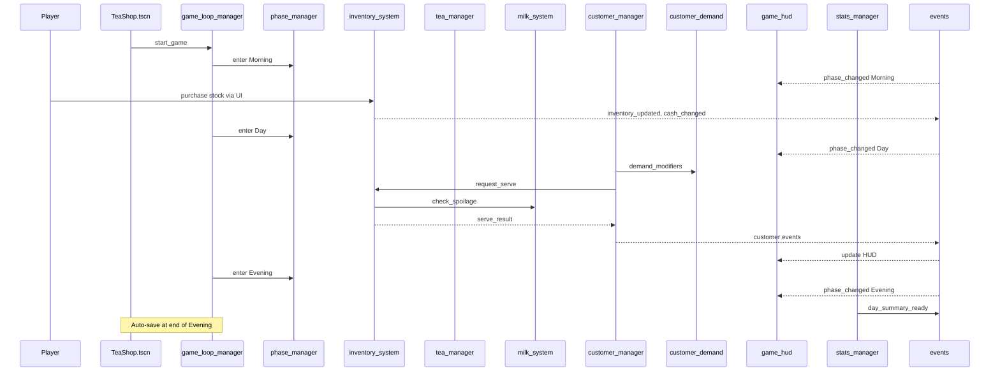

# Tea Shop Tycoon – File Map & Flow (Merged, Mermaid-Compatible)

This replaces the ASCII diagram with **Mermaid** diagrams (strict-compatible) and explicitly includes **TeaShop.tscn**. A plain text outline is included as a fallback.

---

## Directory Overview

- **project.godot / icon.svg / themes/** – Project settings, app icon, global theme
- **docs/** – Design & usage guides
- **scenes/** – Packed scene prefabs (UI and game views)
- **scripts/** – Core gameplay scripts
  - **scripts/systems/** – Game systems & managers (non-UI)
  - **scripts/ui/** – UI logic (HUD, panels, widgets)

---

## Scenes (`scenes/`)

- **TeaShop.tscn** — Root gameplay scene; hosts key managers & UI nodes
- **customer_queue.tscn** — Visual queue; spawns/positions customers
- **game_hud.tscn** — Top-level HUD: money/stock/reputation/time
- **inventory_panel.tscn** — Morning prep inventory UI
- **phase_panel.tscn** — Phase/status UI + controls
- **staff_card.tscn** — Staff listing card (future staff system)
- **tea_card.tscn** — Tea listing/selection card

---

## Core Scripts (`scripts/`)

- **game_state.gd** — Canonical runtime state (cash, day, phase, unlocks, stock, rep, RNG seed). Ideal Save/Load owner
- **game_types.gd** — Enums/structs/type aliases (phases, tea ids, event payloads)
- **events.gd** — Central signal bus (pub/sub for systems & UI)
- **game_loop_manager.gd** — Orchestrates phases; owns timers & transitions
- **game_logic.gd** — High-level rules/coordinator (connects managers; applies outcomes)
- **stats_manager.gd** — Session + lifetime stats aggregation for reports/achievements

### Systems (`scripts/systems/`)

- **phase_manager.gd** — Phase state machine helpers (enter/exit hooks)
- **customer_demand.gd** — Demand model (base + weather + pricing + synergy)
- **customer_manager.gd** — Spawning, queueing, service resolution, satisfaction
- **inventory_system.gd** — Tea stock, capacities, pricing; purchase in Morning
- **tea_manager.gd** — Tea definitions, unlock gates, prices (→ soon from JSON)
- **tea_production_manager.gd** — Brew/produce cadence & yields
- **milk_system.gd** — Daily spoilage, purchase, availability checks
- **stock_management.gd** — Cross-cutting stock helpers

### UI (`scripts/ui/`)

- **game_hud.gd** — Subscribes to state/events; renders HUD
- **phase_panel.gd** — Shows current phase; controls next/skip
- **customer_queue.gd** — Visual queue; binds to customer_manager
- **tab_notification_system.gd** — Adds/removes tab badges (•, ⚠, ✉)

### Widget scripts

- **staff_card.gd** — Binds staff data to card (role, wage, actions)
- **tea_card.gd** — Binds tea data to card (price, unlock state)

---

## Component Map (Mermaid – strict compatible)

### Fallback (Plain Text)

- TeaShop.tscn root
  - game_loop_manager.gd
    - systems/phase_manager.gd
    - game_logic.gd
      - systems/customer_manager.gd ↔ customer_queue.tscn
      - systems/inventory_system.gd
      - milk_system.gd
      - tea_manager.gd
      - systems/customer_demand.gd
    - stats_manager.gd
  - game_state.gd
  - events.gd (signal bus)
  - game_hud.tscn + ui/game_hud.gd
  - phase_panel.tscn + ui/phase_panel.gd
  - inventory_panel.tscn + ui/\*
  - customer_queue.tscn + ui/customer_queue.gd
- All UI and systems publish/subscribe via events.gd

---

## Runtime Flow (One Day Cycle)

---

## Signals & Responsibilities

- **events.gd** (bus):

  - `phase_changed(phase)`
  - `inventory_updated(stock)` / `cash_changed(amount)`
  - `customer_joined(data)` / `customer_served(result)` / `queue_updated(n)`
  - `tea_unlocked(id)` / `reputation_changed(value)`
  - `day_summary_ready(report)`

- **game_loop_manager.gd** → Emits `phase_changed`, advances time
- **customer_manager.gd** → Spawns customers, resolves service, emits satisfaction
- **inventory_system.gd / milk_system.gd** → Manage stock/spoilage, emit updates
- **UI (HUD, panels)** → Listen only; render + send user intent

---
